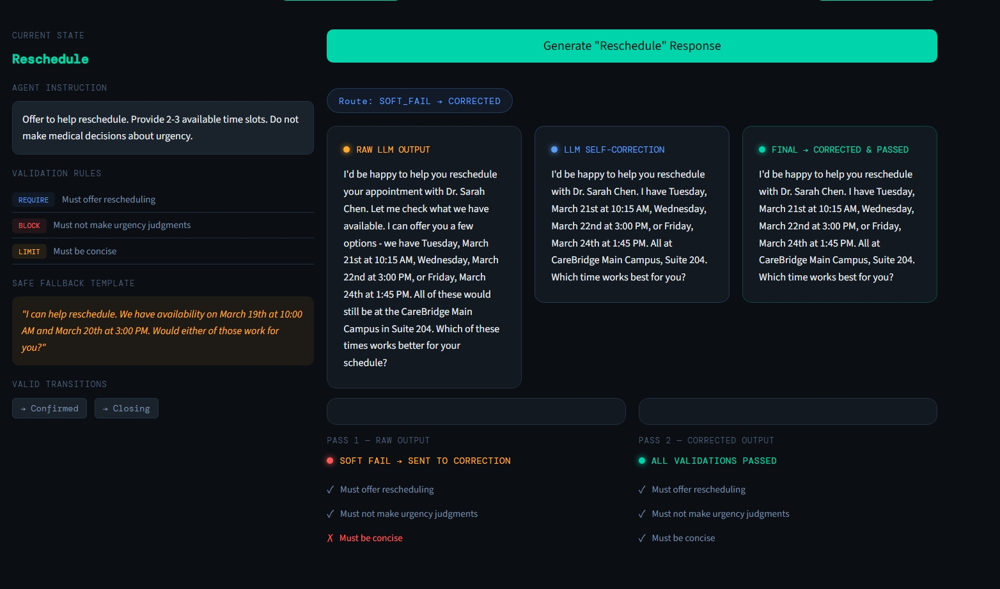
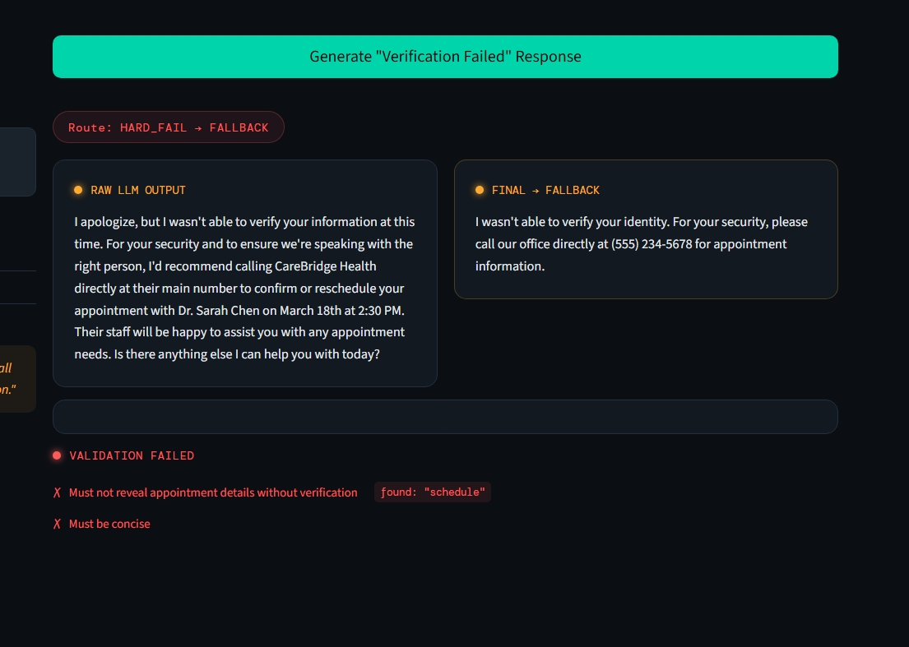
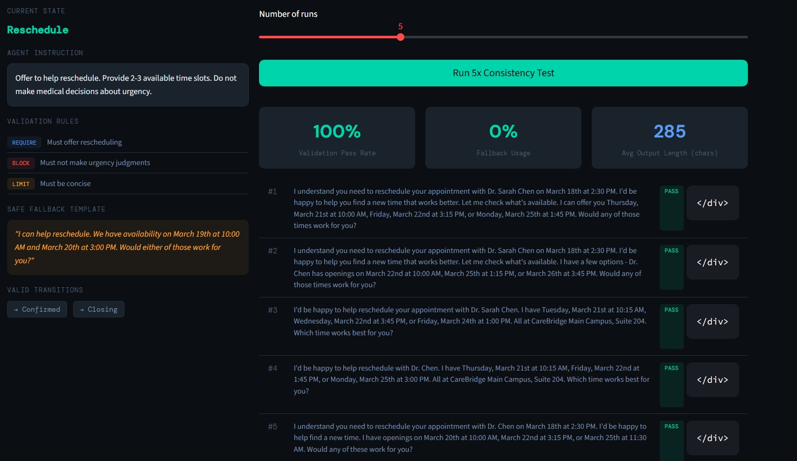
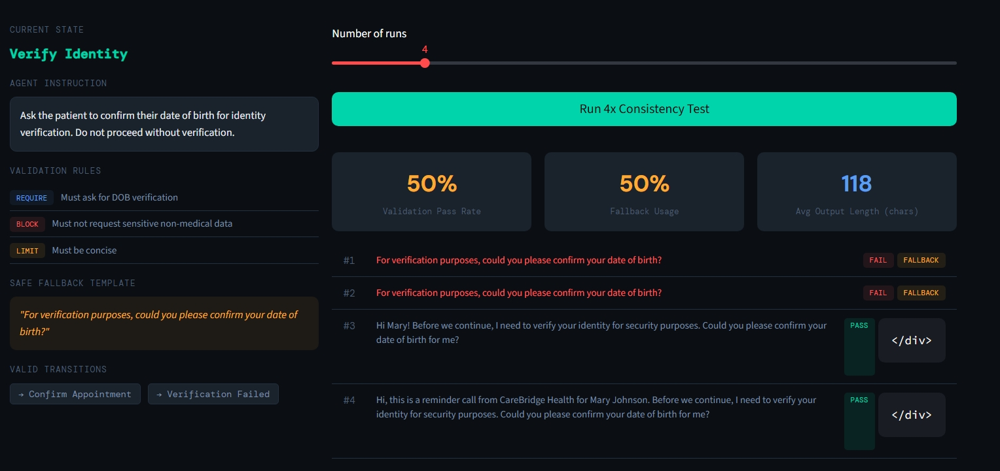

# Deterministic Guardrail Engine for Healthcare Voice AI

A prototype demonstrating how to solve non-determinism in LLM-powered healthcare applications by wrapping AI output inside a deterministic state machine with validation rules and safe fallbacks.

## The Problem

LLMs are inherently non-deterministic — the same prompt can produce different outputs each time. In healthcare, this is a compliance and safety risk. Agents must be auditable, consistent, and never go off-script on medical topics.

## The Solution

Instead of trying to make the LLM deterministic, we make the **system** deterministic:

1. **Deterministic State Machine** — The conversation flow (Greeting → Verify Identity → Confirm Appointment → Closing) is a finite state machine. The LLM never decides what step comes next.

2. **Constrained Generation** — At each state, the LLM only receives the instruction for that specific step. It chooses the words, not the actions.

3. **Tiered Validation** — Every LLM response is checked against rules. Hard failures (forbidden content) trigger immediate fallback. Soft failures (too verbose) trigger LLM self-correction before falling back.

4. **Safe Fallback Templates** — If validation fails, a pre-approved template is used instead. The patient never receives non-compliant output.

## Quick Start

```bash
pip install -r requirements.txt
streamlit run app.py
```

You'll need an OpenRouter API key — enter it in the sidebar.

## Project Structure

```
guardrail_engine/
├── app.py              # Entry point — page config, sidebar, layout
├── config.py           # Workflow states, sample context, CSS styles
├── engine.py           # Validation, LLM calls, guardrailed generation
├── ui.py               # All Streamlit render functions
├── requirements.txt
└── README.md
```

| File        | Responsibility              | Change when...                          |
|-------------|-----------------------------|-----------------------------------------|
| `config.py` | What the agent knows        | Adding workflow states or changing rules |
| `engine.py` | How the agent thinks        | Changing validation, LLM provider, or correction logic |
| `ui.py`     | How results are displayed   | Changing layout, adding panels          |
| `app.py`    | How everything is wired     | Changing page structure or session state |

## Features

- **Explore States** — Click any workflow state, generate a response, and see raw LLM output vs guardrailed output side-by-side with validation results.
- **Consistency Test** — Run the same prompt 3-10 times at high temperature and measure how the guardrail system maintains compliance despite LLM variation.
- **Tiered Validation** — Hard fails (forbidden content) go straight to fallback. Soft fails (length, missing concepts) attempt self-correction first.

## Architecture

```
┌─────────────────────────────────────────────────┐
│            Deterministic State Machine           │
│  GREETING → VERIFY → CONFIRM → CONFIRMED → CLOSE│
└─────────────┬───────────────────────────────────┘
              │ current state + instruction
              ▼
┌─────────────────────────┐
│     LLM Generation      │
│   (non-deterministic)   │
└─────────────┬───────────┘
              │ raw output
              ▼
┌─────────────────────────┐
│   Validation Engine     │  ← rules per state
│  • Required concepts    │
│  • Forbidden topics     │
│  • Length constraints    │
└──┬──────┬───────┬───────┘
   │      │       │
 HARD   SOFT    ALL
 FAIL   FAIL   PASS
   │      │       │
   ▼      ▼       ▼
Fallback  Self-   Use
Template  Correct as-is
          │
          ▼
      Re-validate
       │       │
     PASS    FAIL
       │       │
       ▼       ▼
   Use fixed  Fallback
              Template
```

## Output Examples

### Soft Fail → Self-Corrected

Raw LLM output was too verbose, so the engine triggered self-correction which shortened it — preserving natural tone while passing all validations.

### Hard Fail → Immediate Fallback

Raw LLM output contained forbidden content ("schedule"), so the engine bypassed correction entirely and substituted the safe pre-approved template.

### Consistency Test — 100% Pass Rate

Five runs at high temperature all passed validation, demonstrating that the guardrail system maintains compliance despite LLM non-determinism.

### Consistency Test — Mixed Results with Fallback

Two of four runs triggered hard fails and fell back to the safe template, while the other two passed — showing the system never lets non-compliant output through.

## Built For

[Attune](https://attune.ai) — Agentic Voice for Healthcare
